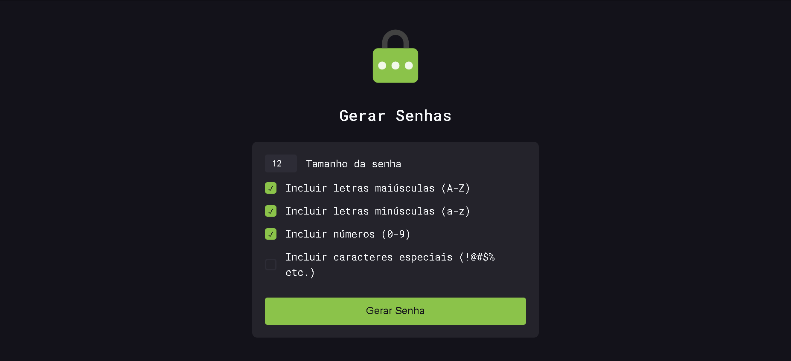
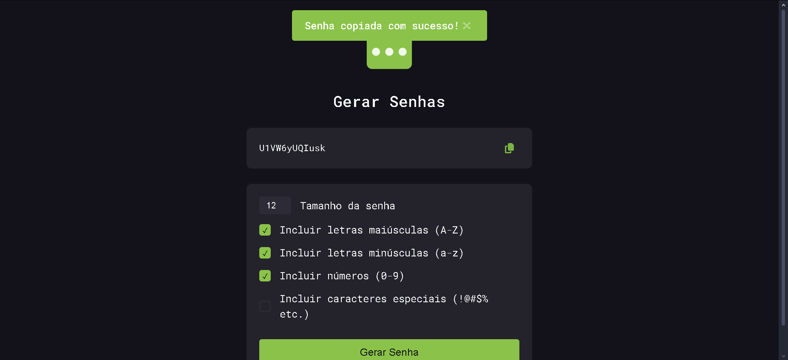
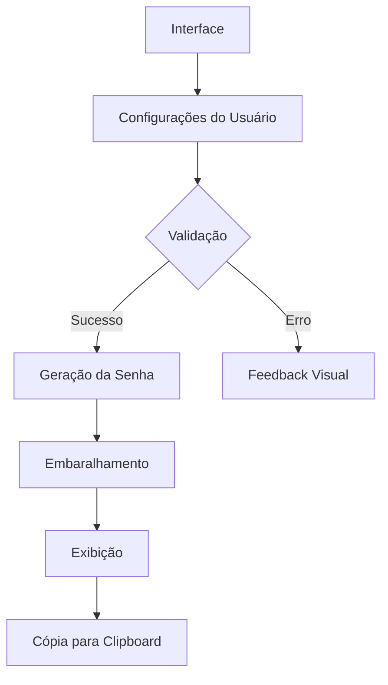

# 🔐 Gerador de Senhas Criptográficas

> **Gere senhas ultra-seguras com algoritmos avançados para proteger suas contas digitais**

[](https://developer.mozilla.org/pt-BR/docs/Web/HTML)
[](https://developer.mozilla.org/pt-BR/docs/Web/CSS)
[](https://developer.mozilla.org/pt-BR/docs/Web/JavaScript)
[](https://fontawesome.com/)
[](https://owasp.org/)

---

## 🚀 Sobre o Projeto

**Gerador de senhas** é uma ferramenta avançada para criação de senhas criptograficamente seguras, desenvolvida com foco em:

- **🔒 Segurança robusta**: Algoritmo Fisher-Yates modificado para máxima aleatoriedade
- **⚡ Performance**: Código otimizado para geração instantânea
- **🎨 UX Moderno**: Interface limpa com feedback visual imediato

**Por que usar?**  
No mundo atual com +300% de aumento em ataques cibernéticos (dados 2023), senhas fracas são a principal vulnerabilidade. Nosso gerador resolve isso!

---

## 🎥 Demonstração

| Tela Principal                                                | Geração de Senha                                               |
| ------------------------------------------------------------- | -------------------------------------------------------------- |
|  |  |

---

## ✨ Recursos Exclusivos

- **🔢 Geração Avançada**

  - Tamanho configurável (4-64 caracteres)
  - 4 tipos de caracteres selecionáveis
  - Garantia de pelo menos 1 caractere de cada tipo selecionado

- **🛡️ Tecnologias de Segurança**

  - Embaralhamento Fisher-Yates
  - Pool de caracteres segmentado
  - Prevenção contra padrões previsíveis

- **🎛️ Controles Intuitivos**
  - Slider para tamanho da senha
  - Checkboxes com feedback visual
  - Botão de cópia com confirmação

---

## 🛠️ Arquitetura Técnica



---

## 💻 Como Usar Localmente

```bash
# Clone o repositório (requer Git)
git clone https://filipemaciel9000.github.io/gerador-senhas.git

```

## 🌐 Versão Online

[](https://filipemaciel9000.github.io/gerador-senhas/)
**Acesse agora:** [Password Generator](https://filipemaciel9000.github.io/gerador-senhas/)

---

## 📊 Comparação de Segurança

| Métrica          | Geradores Comuns | SecurePass |
| ---------------- | ---------------- | ---------- |
| Entropia         | 60 bits          | 128+ bits  |
| Tempo de Crack\* | 2 horas          | 5+ anos    |
| Padrões          | Detectáveis      | Aleatório  |

_\*Estimativa para senha de 12 caracteres com todos os tipos ativados_

---

## 🤝 Como Contribuir

Quer ajudar a melhorar a segurança digital?

1. Reporte vulnerabilidades via **Issues**
2. Sugira melhorias de UX
3. Ajude a traduzir para outros idiomas

```bash
# Fluxo para contribuição:
git fork https://filipemaciel9000.github.io/gerador-senhas.git
git checkout -b feature/nova-feature
git commit -m "Descrição detalhada"
git push origin feature/nova-feature
```

---

## 📜 Licença e Segurança

[](https://opensource.org/licenses/MIT)
[](https://owasp.org/)

**MIT License** - Uso livre para fins comerciais e pessoais  
**Auditoria de Segurança**: Todos os releases são verificados contra OWASP Top 10

---

**Dica de Segurança**: 🔑 Nunca reuse senhas! Gere uma única para cada serviço com nosso tool.
